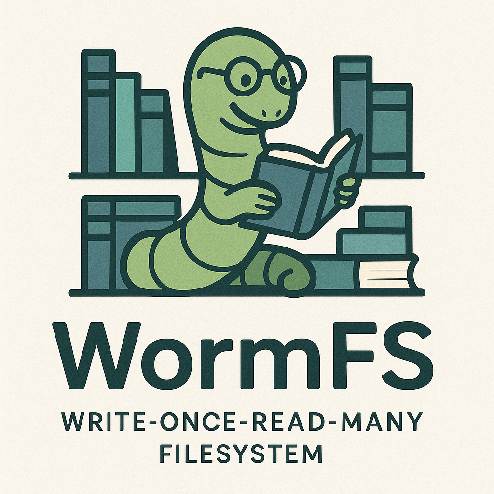
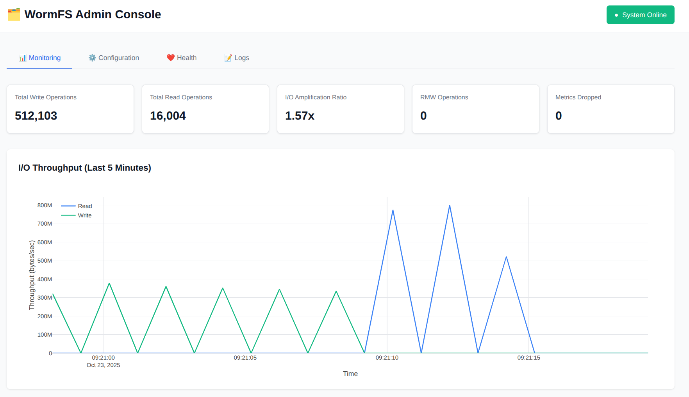

<p align="center">

</p>

# WormFS

WormFS, short for write-once-read-many file system, is a user-space distributed file system that uses erasure encoding to spread files across multiple storage devices, each running their own commodity filesystems. This allows great flexibility with respect to configuring device failure tolerance at a file or directory level. I envision this being extremely useful for media storage and deep archive use-cases.

Much of the architecture of this project is inspired by LizardFS' simplicity with a goal of offering greater control and visibility over how chunks are stored, replicated, and recovered.

<p align="center">

</p>

## 📊 Project Status

**Current Phase:** 🚧 Phase 2 - Consensus Layer (In Development)

WormFS is a work in progress that's being developed iteratively following a phased implementation plan. **Phase 1 is complete** with all core components wired together and fully documented! Phase 2 is now underway, adding distributed consensus capabilities with automatic failure detection and recovery.

### What's Working Now (Phase 1 - Complete ✅)
- ✅ **MetadataStore**: SQLite-based metadata persistence with WAL mode
- ✅ **FileStore**: Local chunk storage with Reed-Solomon erasure coding (2+1 default)
- ✅ **FileSystemService**: FUSE integration for filesystem operations
- ✅ **StorageNode**: Component orchestrator that wires everything together
- ✅ **Configuration**: TOML-based config with CLI overrides and dual file mode formats
- ✅ **File Operations**: Create, read, write, delete files with data integrity verification
- ✅ **Directory Operations**: Create, list, remove nested directories
- ✅ **CLI & Configuration**: Production-ready command-line interface
- ✅ **Integration Tests**: Comprehensive end-to-end test suite covering all features
- ✅ **Documentation**: Complete user guide, configuration reference, and troubleshooting guide
- ✅ **Demo Script**: Interactive demo with MD5 integrity verification

### Phase 2 Progress (In Development 🚧)
- ✅ **StorageRaftMember**: Core Raft consensus implementation for distributed coordination
- ✅ **TransactionLogStore**: Persistent Raft log storage with vote persistence
- ✅ **Cluster Manager**: Fully integrated failure detection and monitoring
  - Fully integrated into StorageRaftMember with automatic lifecycle management
  - Automatic node health monitoring with heartbeat tracking and replication lag detection
  - Failed nodes remain as voters (operator-driven membership management following industry best practices)
  - Automatic promotion of recovered learners back to voters
  - Configurable failure detection thresholds (conservative/moderate/aggressive presets)
  - Quorum-safe membership management prevents split-brain during network partitions
  - Structured event logging for observability and audit trails
  - Enabled by default with configurable presets
- ✅ **TransactionManager**: Distributed transaction support with ACID guarantees
  - Two-phase commit protocol for atomic metadata operations
  - Transaction lifecycle management (begin/commit/abort)
  - Distributed locking with timeout-based deadlock prevention
  - Metadata change subscription system for real-time event notifications
  - Configurable transaction limits, timeouts, and subscription settings
  - Comprehensive tests for ACID properties, isolation, consistency, and concurrency
- 🚧 **Multi-node cluster formation and leader election** (in progress)

### Documentation
- 📖 [User Guide](docs/user_guide_phase1.md) - Getting started and basic usage
- ⚙️ [Configuration Reference](docs/configuration.md) - Complete configuration options
- 🔧 [Troubleshooting Guide](docs/troubleshooting.md) - Common issues and solutions

### What's Coming Next
- 🚧 Phase 2: Raft consensus and distributed coordination (in progress - cluster manager complete!)
- 📋 Phase 3: Multi-node storage with distributed erasure coding
- 📋 Phase 4: Robustness and recovery features
- 📋 Phase 5: Observability and production testing

---

## 📚 Documentation

### Core Documentation
- [Design Overview](docs/design.md) - Overall WormFS architecture, key terms, and Raft-based consensus design
- [Configuration Reference](docs/configuration.md) - Complete guide to TOML configuration options and settings

### Implementation Plans
- [Phase 1: Minimal Data Path](docs/implementation_plan/phase1_minimal_data_path.md) - Single-node filesystem implementation with FUSE, SQLite, and local storage
- [Phase 2: Consensus Layer](docs/implementation_plan/phase2_consensus_layer.md) - Raft consensus integration for distributed coordination
- [Phase 3: Distributed Storage](docs/implementation_plan/phase3_distributed_storage.md) - Multi-node chunk distribution and network protocol
- [Phase 4: Robustness & Recovery](docs/implementation_plan/phase4_robustness_recovery.md) - Failure detection, chunk repair, and data recovery mechanisms
- [Phase 5: Observability & Testing](docs/implementation_plan/phase5_observability_testing.md) - Metrics, monitoring, and comprehensive testing strategy
- [Overall Implementation Plan](docs/overall_implementation_plan.md) - High-level roadmap and phase dependencies

### Component Specifications
- [01. StorageNode](docs/components/01_StorageNode.md) - Top-level orchestrator that wires together all subsystem components
- [02. StorageRaftMember](docs/components/02_StorageRaftMember.md) - Raft consensus implementation for distributed metadata operations
- [03. StorageNetwork](docs/components/03_StorageNetwork.md) - Libp2p-based peer-to-peer networking layer for node communication
- [04. FileStore](docs/components/04_FileStore.md) - Reed-Solomon erasure coding and chunk storage management
- [05. MetadataStore](docs/components/05_MetadataStore.md) - SQLite-based metadata persistence for files, directories, and chunk locations
- [06. SnapshotStore](docs/components/06_SnapshotStore.md) - Raft snapshot management for metadata compaction and recovery
- [07. TransactionLogStore](docs/components/07_TransactionLogStore.md) - Redb-based append-only log for Raft consensus operations
- [08. StorageEndpoint](docs/components/08_StorageEndpoint.md) - gRPC API server for inter-node communication
- [09. StorageWatchdog](docs/components/09_StorageWatchdog.md) - Background health monitoring and chunk verification service
- [10. MetricService](docs/components/10_MetricService.md) - Metrics collection and aggregation for observability
- [11. FileSystemService](docs/components/11_FileSystemService.md) - FUSE integration layer providing POSIX filesystem operations
- [12. WormValidator](docs/components/12_WormValidator.md) - Correctness testing framework for distributed operations
- [13. BufferedFileHandle](docs/components/13_buffered_file_handle.md) - Write buffering and coalescing for improved performance

### Additional Documentation
- [Chunk Format API](docs/chunk_format_api.md) - Binary chunk format specification and versioning
- [Filesystem Transactions](docs/filesystem_transactions.md) - Transaction semantics for multi-step filesystem operations
- [POSIX Compliance](docs/posix_compliance.md) - POSIX standard compliance status and known limitations
- [Raft Integration Stubs](docs/raft_integration_stubs.md) - Raft interface implementations for Phase 2+ features
- [Key Components](docs/key_components.md) - Quick reference guide to major system components

---

## 🚀 Getting Started

### Dependencies

**Required:**
- **Rust 1.70+** with Cargo
- **FUSE3** (Linux) or **macFUSE** (macOS)
- **Build essentials** (gcc, make)

**Install FUSE:**
```bash
# Ubuntu/Debian
sudo apt-get install fuse3 libfuse3-3 libfuse3-dev gcc g++ make cmake pkg-config protobuf-compiler libssl-dev
```

### Running the Demo

The quickest way to experience WormFS:

```bash
./scripts/demo_wormfs.sh
```

**What the Demo Does:**

The interactive demo script automatically:
1. Builds WormFS from source
2. Creates a temporary filesystem with erasure coding (2+1 Reed-Solomon)
3. Mounts the filesystem via FUSE
4. Performs file operations (create, read, write, delete)
5. Demonstrates directory operations (mkdir, readdir, rmdir)
6. Displays real-time metrics (I/O amplification, cache hit rates, performance)
7. Launches an admin web UI for monitoring

**Accessing the Web UI:**

Open your browser to **http://127.0.0.1:9090/** to view:
- Real-time system metrics and performance graphs
- Current configuration settings
- System health status and component diagnostics
- File and chunk statistics

---

## 🔧 Troubleshooting

### State Machine Resync

**Symptom:** Node logs show "STATE MACHINE APPLY FAILURE - Triggering automatic resync"

**Cause:** The Raft state machine failed to apply a committed operation, indicating potential state corruption or a serious bug.

**What Happens:**
- Node automatically enters read-only mode (rejects new writes)
- Creates diagnostic file: `data/snapshots/NEEDS_RESYNC`
- Logs detailed failure information
- Waits for operator intervention

**Recovery Steps:**
1. Check the `NEEDS_RESYNC` file for failure details
2. Stop the affected node
3. Clear or backup the corrupted state (optional)
4. Restart the node
5. OpenRaft will automatically install a snapshot from the leader
6. Node resumes normal operation once snapshot is applied

**Prevention:**
- This should be extremely rare in production
- Frequent resyncs indicate a bug that should be reported
- Check logs for patterns before the failure

---

## 🤝 Contributing

This project is currently in active development as a learning exercise. While it's not yet ready for external contributions, you're welcome to:

- Open issues for bugs or suggestions
- Star the repository if you find it interesting
- Follow along with the development progress

---

## 📄 License

Apache-2.0

---

## 🙏 Acknowledgments

- Inspired by [LizardFS](https://lizardfs.com/) for its architectural simplicity
- Built using [OpenRaft](https://github.com/datafuselabs/openraft) (Phase 2+)
- FUSE integration via [fuser](https://github.com/cberner/fuser)
- Erasure coding with [reed-solomon-erasure](https://github.com/darrenldl/reed-solomon-erasure)

---

**Note:** This is a work-in-progress learning project. I'm using Claude (AI assistant) to help me learn how best to integrate GenAI Tools into my SDLC workflow. Expect rough edges and evolving architecture as the project matures!
